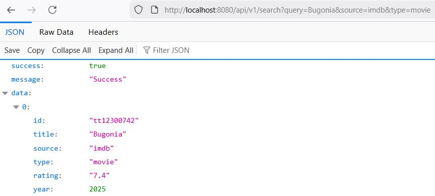
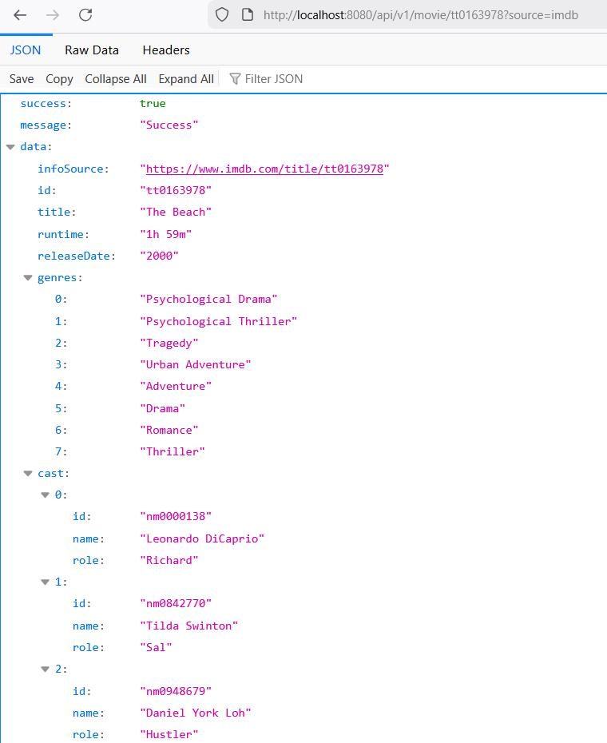

# Spring Boot based microservice with REST API for scraping infos about Movies and Tv Shows from pages like [IMDb](https://www.imdb.com)

This is part of a "watchlist app" project I'm working on

## What works so far

### Scraping IMDb 
- Search movies and Tv Shows
- Get details about movies, tv shows, seasons, episodes
  - rating
  - actors/actresses
  - runtime
  - release date
  - poster url
  - ...

Just try it out or check [this](./src/main/resources/implSteps.md) for more details.

### Examples

Search for movies or tv shows:

Fetching details about a movie or tv show:

## Planned

- Scraping other sites like TMDb
- Search for sources (torrents, streams, etc.)

## Todo

You can find details [here](./src/main/resources/todo.md).
Wanna help? I'm happy to receive PRs.

